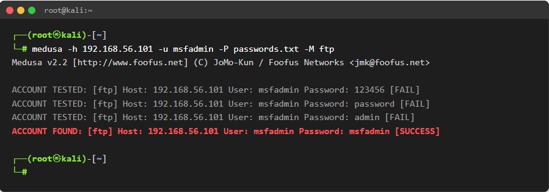
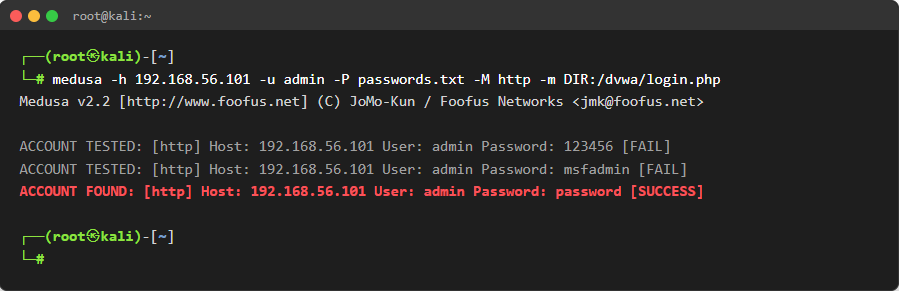
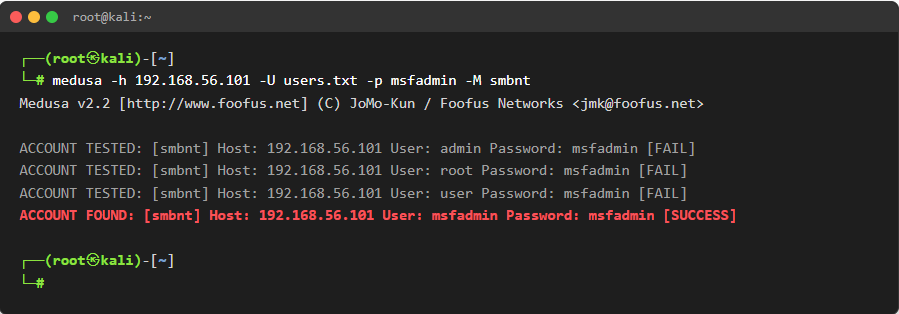

# 🛡️ Simulação de Ataques de Força Bruta com Kali Linux e Medusa

Este repositório contém a documentação e execução prática de um projeto de cibersegurança focado em ataques de força bruta. O objetivo principal é demonstrar a eficácia da ferramenta **Medusa** na auditoria de serviços de rede comuns, identificando vulnerabilidades e propondo medidas de mitigação adequadas. Projeto desenvolvido para o desafio da DIO.

---

## 💻 Ambiente de Testes

O ambiente foi configurado de forma isolada e segura (Host-Only) utilizando o VirtualBox, garantindo que os testes não afetem redes externas.

| Máquina / Sistema | Papel no Cenário | IP Configurado (Exemplo) |
| :--- | :--- | :--- |
| **Kali Linux** | Atacante (Pentester) | `192.168.56.100` |
| **Metasploitable 2** | Alvo Vulnerável | `192.168.56.101` |

> **Nota:** O Metasploitable 2 possui diversos serviços desatualizados e mal configurados por padrão, servindo como um excelente laboratório de estudos. O DVWA (Damn Vulnerable Web App) está hospedado dentro desta máquina.

---

## 🛠️ Ferramentas Utilizadas

* **Nmap:** Para enumeração inicial e descoberta de portas abertas.
* **Medusa:** Ferramenta modular, rápida e paralela para ataques de força bruta em logins.
* **Wordlists customizadas:** Arquivos de texto contendo combinações comuns de usuários e senhas.

---

## 🚀 Execução dos Cenários de Ataque

### Cenário 1: Força Bruta no Serviço FTP (Porta 21)
**Objetivo:** Obter acesso não autorizado ao servidor FTP utilizando uma lista de senhas comuns.

1. **Enumeração:** Verificamos que a porta 21 estava aberta no alvo.
2. **Ataque:** Utilizamos um usuário conhecido (`msfadmin`) e uma wordlist de senhas.
3. **Comando Executado no Kali:**
   ```bash
   medusa -h 192.168.56.101 -u msfadmin -P passwords.txt -M ftp

---

## 📊 Apresentação dos Resultados (Evidências)

Abaixo estão as capturas de tela do terminal do Kali Linux que comprovam a execução bem-sucedida da ferramenta Medusa em cada um dos cenários propostos. A flag `[SUCCESS]` indica o momento exato em que a credencial foi comprometida.

### 📸 1. Quebra de Credenciais do FTP
*(Ataque de dicionário tradicional contra a porta 21)*


> **Observação:** O terminal exibe a combinação correta `msfadmin:msfadmin` sendo validada com sucesso, garantindo o acesso ao servidor FTP.

---

### 📸 2. Força Bruta no Login do DVWA
*(Ataque automatizado contra formulário de autenticação HTTP)*


> **Observação:** O módulo web do Medusa conseguiu testar as credenciais no diretório e identificar a combinação válida `admin:password`.

---

### 📸 3. Password Spraying no serviço SMB
*(Teste de uma senha comum contra múltiplos usuários)*


> **Observação:** O teste varreu nossa *wordlist* de usuários e rapidamente encontrou um "match" correspondente à senha informada no serviço de compartilhamento de arquivos.
